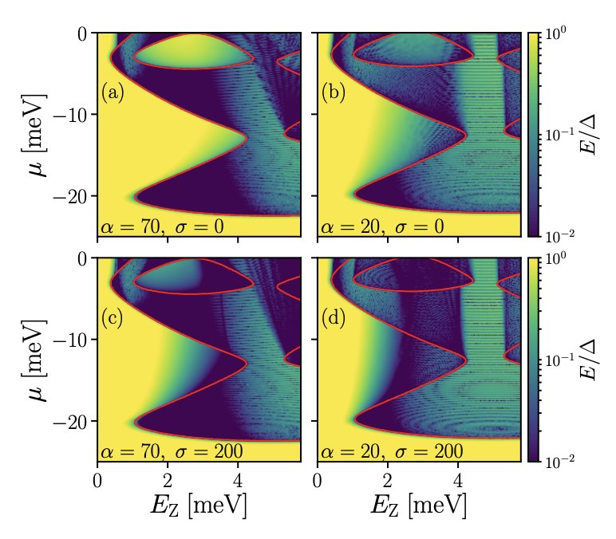
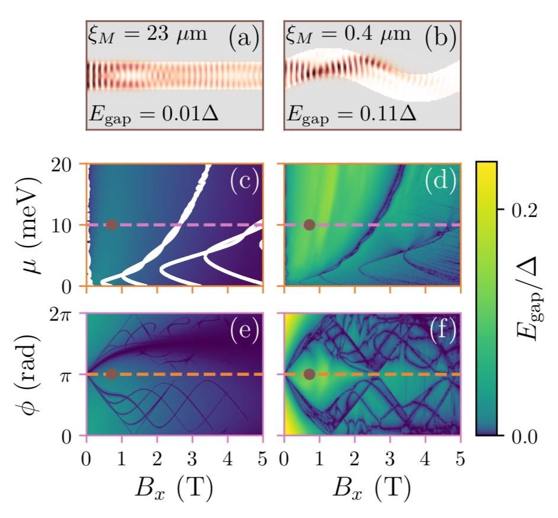
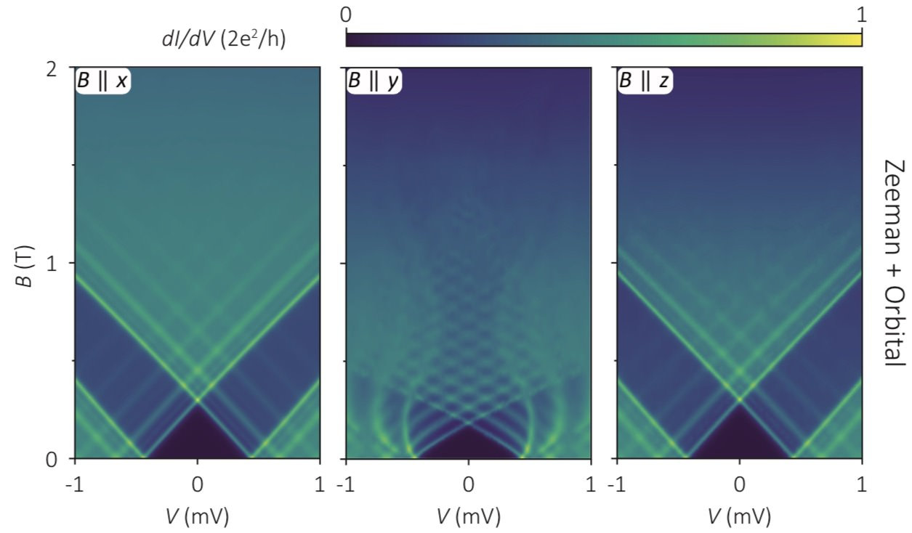
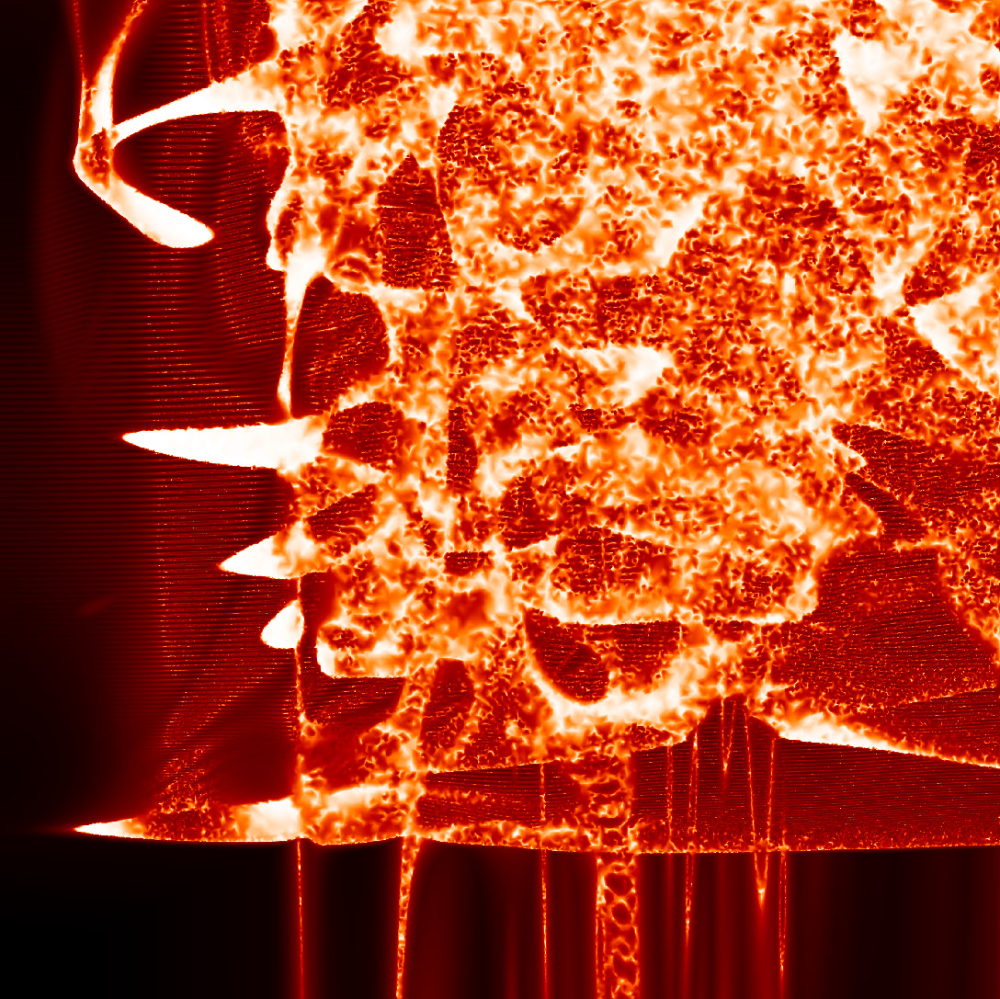

Gallery
-------

Adaptive has been used in the following scientific publications:

| **Reproducing topological properties with quasi-Majorana states**
| by A. Vuik, B. Nijholt, A. R. Akhmerov, M. Wimmer
| `arXiv:1806.02801 <https://arxiv.org/abs/1806.02801>`_ and the `source-code <https://zenodo.org/record/1285177>`_

| **Enhanced proximity effect in zigzag-shaped Majorana Josephson junctions**
| by Tom Laeven, Bas Nijholt, Anton R. Akhmerov, Michael Wimmer
| `arXiv:1903.06168 <https://arxiv.org/abs/1903.06168>`_ and the `source-code <https://zenodo.org/record/2578027>`_

| **Spin-Orbit Protection of Induced Superconductivity in Majorana Nanowires**
| by Jouri D.S. Bommer, Hao Zhang, Önder Gül, Bas Nijholt, Michael Wimmer, Filipp N. Rybakov, Julien Garaud, Donjan Rodic, Egor Babaev, Matthias Troyer, Diana Car, Sébastien R. | Plissard, Erik P.A.M. Bakkers, Kenji Watanabe, Takashi Taniguchi, Leo P. Kouwenhoven
`arXiv:1807.01940 <https://arxiv.org/abs/1807.01940>`_

Other examples:

| **Battle for Majoranas**
| by `Bas Nijholt <https://github.com/basnijholt>`_
| Accidentally leaving the cluster running over the weekend without a ``runner.goal`` and with a bug in the simulation parameters led to this beautiful mess.

Did you use Adaptive for something cool? Let us `know <https://github.com/python-adaptive/adaptive/issues/new>`_ and we will add it to this gallery.
